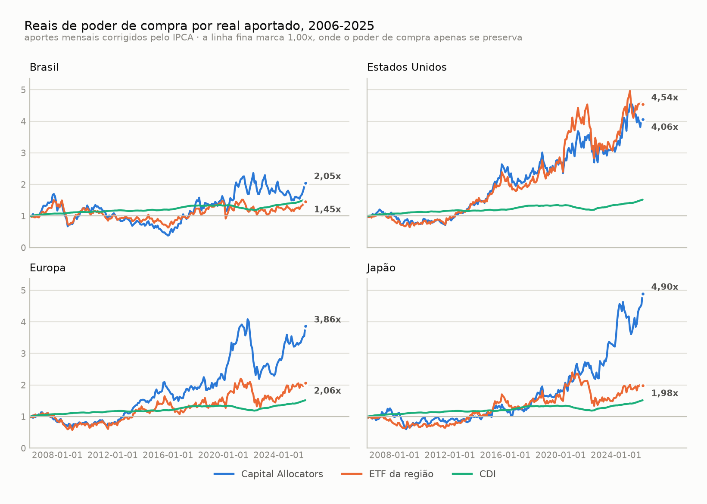
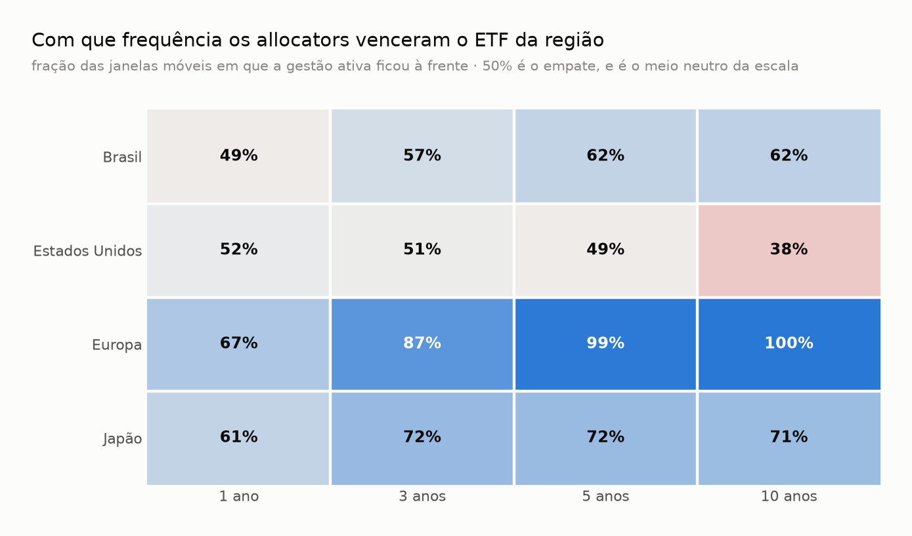
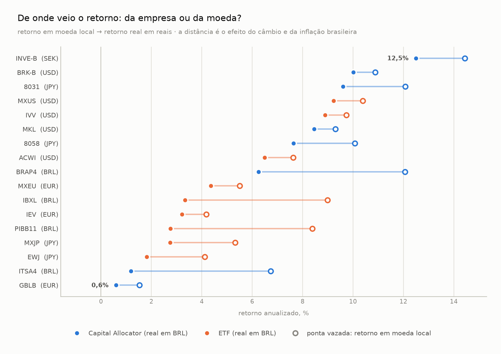
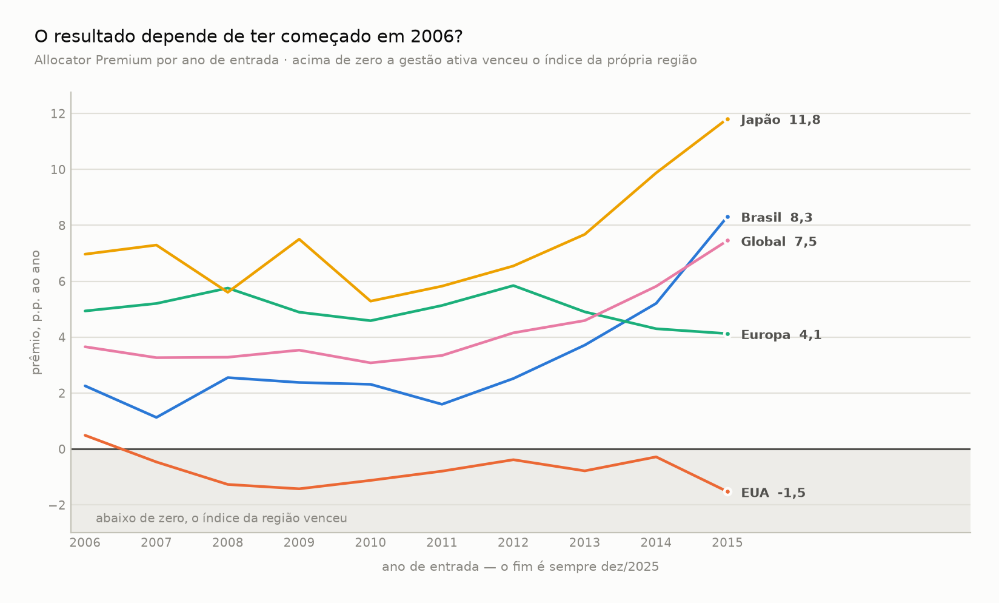
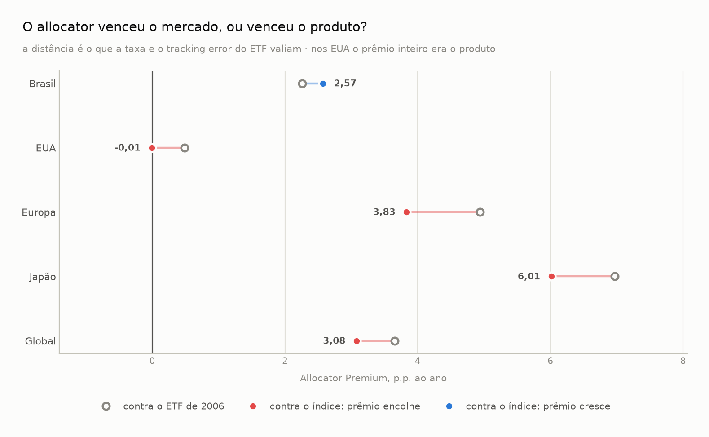
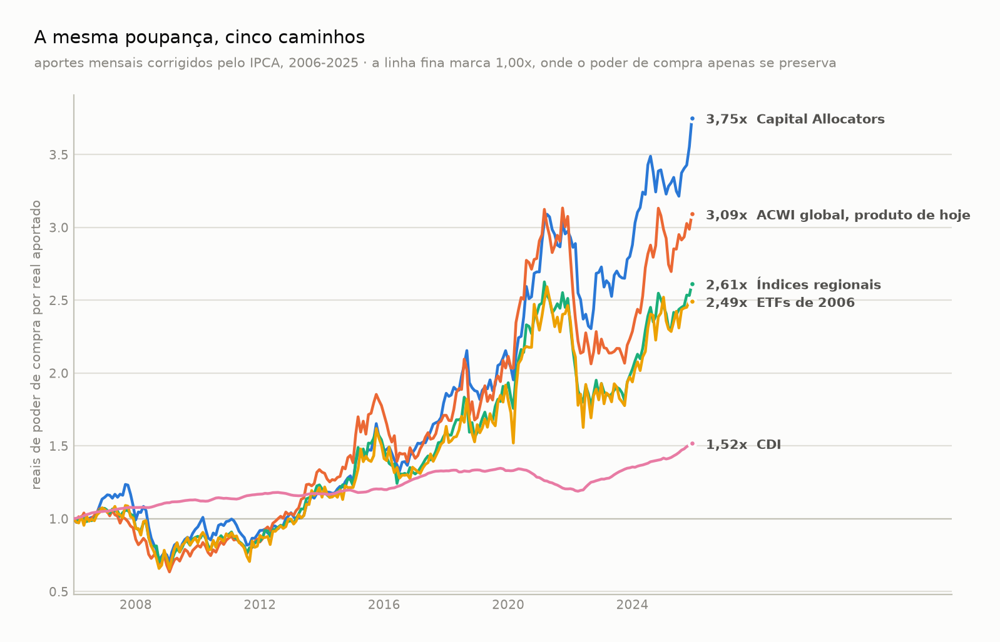

# Capital Allocators vs Passive Investing

Sistema de backtesting que compara, sob a ótica de um **investidor brasileiro** com
aportes mensais entre **jan/2006 e dez/2025** (240 meses), três caminhos:

| Papel | Estratégia |
|---|---|
| Gestão ativa | **Capital Allocators** — 8 empresas, 2 por região |
| Gestão passiva | **ETFs** amplos dos mesmos 4 mercados |
| Referência de mercado | **Índices** dos mesmos 4 mercados (experimento §7) |
| Contrafactual moderno | **ACWI global**, o produto de hoje (experimento §7) |
| Custo de oportunidade | **CDI** |
| Régua de poder de compra | **IPCA** (não é investimento) |

> Entre 2006 e 2025, qual foi a recompensa obtida por um investidor brasileiro ao
> escolher grandes alocadores de capital, investir passivamente através de ETFs
> ou permanecer em renda fixa?

O sistema executa uma metodologia **definida previamente** e apresenta os resultados,
inclusive se contradisserem a hipótese inicial.

## Universo

### Capital Allocators

| Região | Ativo 1 | Ativo 2 |
|---|---|---|
| 🇧🇷 Brasil | Itaúsa (ITSA4) | Bradespar (BRAP4) |
| 🇺🇸 EUA | Berkshire Hathaway (BRK.B) | Markel (MKL) |
| 🇪🇺 Europa | Investor AB (INVE-B, SEK) | GBL (GBLB, EUR) |
| 🇯🇵 Japão | Mitsubishi Corp (8058, JPY) | Mitsui & Co (8031, JPY) |

### ETFs — Historical Reality

| Região | ETF | Índice | Início |
|---|---|---|---|
| 🇧🇷 Brasil | PIBB11 | IBrX-50 | jul/2004 |
| 🇺🇸 EUA | IVV | S&P 500 | mai/2000 |
| 🇪🇺 Europa | IEV | S&P Europe 350 | jul/2000 |
| 🇯🇵 Japão | EWJ | MSCI Japan | mar/1996 |

Os **índices** da coluna do meio entram como um segundo tipo de experimento
(*Index Benchmark*, §7), com o mercado no lugar do produto — resultados nunca
misturados com os do placar principal.

**Regra anti-cherry-picking:** todo ativo precisa ser justificável com informação
que já existia aproximadamente em 31/12/2005. Depois de fechado o universo,
resultado ruim **não** é motivo para remover um ativo.

## Arquitetura

```
FONTES → PYTHON (coleta, ETL, validação) → PARQUET
                                              ↓
                                    RUST (backtest engine)
                                              ↓
                              PYTHON (estatística, gráficos)
```

O motor Rust é **genérico**: nenhum ticker, índice ou país é hard-coded. As
estratégias são declaradas em TOML (ver `strategies/`). O experimento financeiro
é uma *aplicação* do motor, não o motor.

As figuras são geradas por `capallo charts` e versionadas em `docs/img`, em dois
temas — a paleta foi passada por validador de daltonismo nos dois modos, e cada
figura tem a tabela correspondente logo abaixo, para quem lê sem enxergar cor.

## Layout

```
python/capallo/     pipeline de dados e análise
  ingest/           coletores por fonte
  transform/        normalização, FX, total return
  analysis/         métricas, rolling windows, relatórios
engine/             backtest engine em Rust
strategies/         definições .toml das estratégias
data/               raw → interim → curated (fora do git)
docs/               metodologia e decisões
  img/              figuras do estudo, nos temas claro e escuro
tests/              testes do pipeline
```

## Estado

**Pré-desenvolvimento.** Spike de dados concluído — ver `docs/spike-dados.md`.

| Camada | Estado | Fonte |
|---|---|---|
| CDI, IPCA, câmbio | ✅ resolvida e validada | Banco Central (SGS + Olinda/PTAX) |
| BRK-B, MKL, IVV, IEV, EWJ | ✅ total return, 240/240 meses | Twelve Data (plano gratuito) |
| ITSA4, BRAP4, PIBB11 (preço) | ✅ 4.953 pregões cada, 2006-2025 | B3, arquivo `COTAHIST` |
| Proventos Brasil (dinheiro) | ✅ 644 registros, dividendo × JCP separados | B3, proxy oficial |
| Eventos em ações Brasil | ✅ ITSA4 completa; 2 desdobramentos de BRAP4 recuperados | B3 + detecção por salto |
| **Total return Brasil** | ✅ **fechado e validado** | COTAHIST + eventos + proventos |
| 8058, 8031 (preço) | ✅ 240/240 meses, preço puro conferido contra o relatório das companhias | Kabutan 株探 (japonês) |
| INVE-B (preço) | ✅ 240/240 meses | Avanza (sueco) |
| **Proventos SE** | ✅ 27 parcelas com data-ex, 2006-2025 | central de dados do IR da Investor AB |
| **Proventos JP** | ✅ 20/20 exercícios, 8058 e 8031 | relatórios anuais das companhias (PDF) |
| GBLB (preço) | ✅ 240/240 meses, Bruxelas em EUR | onvista (alemão) |
| **Proventos BE** | ✅ 20/20 exercícios | relatórios anuais do GBL (PDF) |
| **Total return EU e JP** | ✅ **fechado e validado** | preço + provento, convenção de data-ex declarada |

**Os 12 ativos estão no painel do motor**, com total return em moeda local
convertido a real pela PTAX de venda. Não há mais buraco de dado nem
transformação pendente: o estudo passou de coleta para análise.

Barra a ser batida, já quantificada: o **CDI rendeu 4,46% a.a. reais** entre 2006
e 2025 (IPCA acumulado 192,0%; CDI nominal 10,20% a.a.). É o número que Allocators
e ETFs precisam superar para o risco ter compensado.

Os dados internacionais são **essenciais** — sem eles não existem a comparação
regional, o Allocator Premium nem a pergunta central. Três rodadas de busca estão
documentadas em `docs/spike-dados.md`: agregadores, fontes primárias e automação
de navegador. Conclusão: o histórico global exige fonte paga ou coleta via
relatórios de RI.

## Resultados — universo completo

Motor Rust rodando sobre dado real, **os doze ativos**. Aportes mensais de
R$1.000 corrigidos pelo IPCA, jan/2006 a dez/2025, ótica do investidor
brasileiro, dividendos reinvestidos líquidos de retenção na fonte.

<picture>
  <source media="(prefers-color-scheme: dark)" srcset="docs/img/crescimento-dark.png">
  
</picture>

| Estratégia | R$ por R$1 aportado | Retorno real a.a. | Vol. | Máx. drawdown | Sharpe |
|---|---|---|---|---|---|
| JP Allocators (8058 + 8031) | **4,90** | 8,79% | 21,97% | −33,8% | 0,29 |
| US ETF (IVV) | 4,54 | 8,93% | 22,10% | −32,1% | 0,30 |
| US Allocators (BRK-B + MKL) | 4,06 | 9,42% | 22,14% | −23,6% | 0,32 |
| EU Allocators (INVE-B + GBLB) | 3,86 | 8,17% | 18,17% | −40,1% | 0,28 |
| EU ETF (IEV) | 2,06 | 3,23% | 24,12% | −32,7% | 0,07 |
| BR Allocators (ITSA4 + BRAP4) | 2,05 | 5,03% | 27,93% | −41,7% | 0,16 |
| JP ETF (EWJ) | 1,98 | 1,82% | 21,97% | −31,7% | −0,01 |
| CDI | 1,52 | 4,43% | 0,94% | 0,0% | 0,00 |
| BR ETF (PIBB11) | 1,45 | 2,77% | 21,31% | −40,5% | 0,03 |

Vitórias dos allocators sobre o ETF da mesma região, em janelas móveis:

<picture>
  <source media="(prefers-color-scheme: dark)" srcset="docs/img/janelas-moveis-dark.png">
  
</picture>


| Região | 1 ano | 3 anos | 5 anos | 10 anos |
|---|---|---|---|---|
| Brasil | 49% | 57% | 62% | 62% |
| EUA | 52% | 51% | 49% | **38%** |
| Europa | 67% | 87% | 99% | **100%** |
| Japão | 61% | 72% | 72% | 71% |

O resultado **não é uniforme entre regiões**, e é essa a descoberta: nos EUA o
índice venceu os allocators em janelas longas; na Europa e no Japão, o contrário.
Um estudo que olhasse só o mercado americano teria concluído o oposto de um que
olhasse só o japonês.

⚠️ Duas omissões conhecidas, ambas na borda da janela e ambas contra os
allocators: falta o dividendo do GBL pago em maio de 2006 (exercício de 2005, sem
relatório publicado) e a parcela interina japonesa de setembro de 2025 (exercício
que fecha em março de 2026). Ver `build_intl.py`.

### De onde veio o retorno

`retorno real em BRL = retorno local do ativo × efeito da moeda ÷ inflação`. Os
três fatores se multiplicam, e separá-los muda a leitura: o câmbio contribuiu com
3% a 4,7% ao ano para todo ativo estrangeiro, e sozinho responde por metade do
resultado de EWJ e IEV.

<picture>
  <source media="(prefers-color-scheme: dark)" srcset="docs/img/decomposicao-dark.png">
  
</picture>

| Ativo | Moeda | Ativo a.a. | Câmbio a.a. | Real em BRL a.a. |
|---|---|---|---|---|
| INVE-B | SEK | 14,43% | 3,69% | **12,50%** |
| BRK-B | USD | 10,88% | 4,65% | 10,02% |
| 8031 | JPY | 12,08% | 3,14% | 9,60% |
| IVV | USD | 9,74% | 4,65% | 8,89% |
| MKL | USD | 9,30% | 4,65% | 8,45% |
| 8058 | JPY | 10,07% | 3,14% | 7,64% |
| BRAP4 | BRL | 12,07% | — | 6,25% |
| IEV | EUR* | 4,18% | 4,50% | 3,21% |
| PIBB11 | BRL | 8,38% | — | 2,76% |
| EWJ | JPY* | 4,11% | 3,14% | 1,82% |
| ITSA4 | BRL | 6,73% | — | 1,19% |
| GBLB | EUR | 1,53% | 4,50% | **0,59%** |

\* IEV e EWJ liquidam em dólar, mas o câmbio é atribuído à moeda do mercado
subjacente — sem isso a perna passiva apareceria como aposta em dólar contra uma
perna ativa em euro e iene, carregando as duas a mesma economia.

### Allocator Premium, sempre ao lado do risco

| Região | Allocators | ETF | Prêmio | Vol. extra | Δ Sharpe | Veredito |
|---|---|---|---|---|---|---|
| Brasil | 5,03% | 2,77% | +2,26 p.p. | +6,62 p.p. | +0,12 | prêmio com risco extra |
| EUA | 9,42% | 8,93% | +0,49 p.p. | +0,03 p.p. | +0,02 | mesmo risco, com prêmio |
| Europa | 8,17% | 3,23% | +4,94 p.p. | −5,95 p.p. | +0,21 | **dominância** |
| Japão | 8,79% | 1,82% | +6,97 p.p. | −0,00 p.p. | +0,30 | mesmo risco, com prêmio |
| **Global** | **8,87%** | **5,21%** | **+3,66 p.p.** | −6,35 p.p. | +0,25 | **dominância** |

A carteira ativa entregou 3,75x o poder de compra aportado contra 2,49x da
passiva, com **menos** volatilidade (13,2% contra 19,6%) — oito empresas em quatro
regiões diversificam mais que quatro índices regionais.

E o resultado **não depende de uma empresa excepcional**: o maior peso final é
21,0% (Investor AB), o HHI da carteira é 0,148 contra 0,125 do equilíbrio
perfeito, e o pior ativo do universo — GBL, com 0,59% real ao ano — permaneceu na
carteira, como a regra anti-cherry-picking exige.

⚠️ Nos EUA a vantagem é de 0,49 p.p. ao ano — dentro do que qualquer premissa de
custo ou tributação move —, e em janelas de 10 anos o índice ainda venceu em 62%
delas. Quem olhasse só o mercado americano concluiria bem menos do que quem
olhasse o Japão. **A dispersão entre regiões é a descoberta, não o placar
global.** E o teste de janelas de início abaixo mostra que essa vantagem
americana é frágil de um jeito que o placar de 2006 escondia.

### O resultado depende de ter começado em 2006?

A §9 da metodologia prevê refazer o estudo começando em cada janeiro de 2006 a
2015, sempre até dez/2025. É o teste anti-cherry-picking mais direto que existe:
uma conclusão que só sobrevive numa data de início é uma conclusão sobre a data de
início.

Prêmio em p.p. ao ano, por ano de entrada:

<picture>
  <source media="(prefers-color-scheme: dark)" srcset="docs/img/janelas-de-inicio-dark.png">
  
</picture>


| Início | Brasil | EUA | Europa | Japão | Global |
|---|---|---|---|---|---|
| 2006 | +2,26 | **+0,49** | +4,94 | +6,97 | +3,66 |
| 2007 | +1,13 | −0,46 | +5,20 | +7,29 | +3,27 |
| 2008 | +2,55 | −1,27 | +5,76 | +5,61 | +3,28 |
| 2009 | +2,38 | −1,42 | +4,89 | +7,50 | +3,54 |
| 2010 | +2,31 | −1,12 | +4,59 | +5,29 | +3,08 |
| 2011 | +1,60 | −0,79 | +5,13 | +5,82 | +3,34 |
| 2012 | +2,52 | −0,38 | +5,85 | +6,55 | +4,16 |
| 2013 | +3,72 | −0,78 | +4,91 | +7,68 | +4,59 |
| 2014 | +5,21 | −0,28 | +4,30 | +9,88 | +5,82 |
| 2015 | +8,32 | −1,53 | +4,13 | +11,82 | +7,46 |
| **positivas** | **10/10** | **1/10** | **10/10** | **10/10** | **10/10** |

Duas leituras, em direções opostas.

**O prêmio global sobrevive a todas as dez janelas**, entre +3,08 e +7,46 p.p. — e
2006, o início que o estudo escolheu, é a **terceira pior** delas. A escolha de
janela não está inflando o resultado; está deflacionando. A Europa é a região mais
estável de todas, entre +4,13 e +5,85 sem uma única janela negativa.

**E a vantagem americana some.** O +0,49 p.p. do placar principal é a **única
janela positiva das dez**; começando em qualquer outro ano de 2007 a 2015, o
índice americano vence os allocators. O veredito "mesmo risco, com prêmio" dos EUA
é um artefato do ponto de partida, e passa a ser lido assim. Isso não enfraquece a
descoberta central — **reforça**: a dispersão entre regiões é maior do que o placar
de 2006 sugeria, não menor.

### Index Benchmark: o allocator venceu o mercado ou venceu o produto?

O placar principal compara gestão ativa com **o ETF que dava para comprar em
2006** — a pergunta certa para um investidor, mas não a pergunta "gestão ativa
bate o mercado". A §7 prevê um segundo tipo de experimento para separar as duas:
o **índice** no lugar do produto, sem taxa de administração e sem tracking error.

<picture>
  <source media="(prefers-color-scheme: dark)" srcset="docs/img/index-benchmark-dark.png">
  
</picture>

| Região | Allocators | ETF | Índice | Prêmio vs ETF | vs índice | Custo do produto |
|---|---|---|---|---|---|---|
| Brasil | 5,03% | 2,77% | 2,46% | +2,26 p.p. | **+2,57** | **−0,31** |
| EUA | 9,42% | 8,93% | 9,43% | +0,49 p.p. | **−0,01** | +0,50 |
| Europa | 8,17% | 3,23% | 4,34% | +4,94 p.p. | +3,83 | +1,11 |
| Japão | 8,79% | 1,82% | 2,78% | +6,97 p.p. | +6,01 | +0,96 |
| **Global** | **8,87%** | 5,21% | 5,79% | **+3,66 p.p.** | **+3,08** | **+0,58** |

**O prêmio global sobrevive: cai de +3,66 para +3,08 p.p. ao ano.** Cerca de 0,58
p.p. — um sexto dele — era o custo de embrulhar o mercado num fundo, não gestão de
capital. O resto continua de pé.

**Nos EUA, o prêmio inteiro era o produto.** Contra o índice ele é −0,01 p.p.:
zero. Somado ao teste de janelas de início, em que os EUA são positivos em 1 de 10
entradas, o veredito americano de "mesmo risco, com prêmio" não sobrevive a nenhum
dos dois testes. Berkshire e Markel não venceram o mercado americano — venceram um
ETF, por uma margem que é a taxa do ETF.

**No Brasil o experimento anda para o outro lado**, e isso é sinal de que ele não
está viciado: o PIBB11 **superou** o IBrX-50 em 0,31 p.p. ao ano, então trocar o
produto pelo índice *aumenta* o prêmio. O estudo não tem dado para decompor por
quê — receita de aluguel de ações e convenção de reinvestimento do índice são as
hipóteses óbvias, e nenhuma foi testada aqui.

#### De onde vêm os índices, e o que é substituto

| Índice | Fonte | É o índice do ETF? |
|---|---|---|
| IBrX-50 | B3, estatísticas históricas | ✅ é o índice do PIBB11 |
| MSCI Japan | MSCI, dados de fim de dia | ✅ é o índice do EWJ |
| MSCI USA | MSCI | ⚠️ o do IVV é o S&P 500 |
| MSCI Europe | MSCI | ⚠️ o do IEV é o S&P Europe 350 |

A S&P Dow Jones responde **403** a qualquer requisição de nível de índice. A MSCI
publica de graça, mensal, nas três variantes. Então metade do experimento usa o
índice exato e metade usa o índice da mesma região com outra regra de construção —
e o tamanho dessa troca é **medido**, comparando cada índice com o total return
bruto do próprio ETF: +0,05 p.p. ao ano no IVV (imaterial), +0,87 no IEV (mistura
custo de produto e diferença de índice, e esta fonte não separa as duas parcelas).
Onde o índice é o do próprio ETF, a diferença é só produto: +0,68 p.p. no EWJ,
contra taxa declarada de 0,50%.

A retenção de 30% da §4 é aplicada **por fora**, pelo mesmo método de
`transform.us_net`, em vez de usar a variante `NETR` da MSCI — que já vem líquida,
mas com as alíquotas que a MSCI assume. Usar `NETR` faria a perna do índice ser
tributada diferente da perna do ETF, e a comparação mediria regime fiscal em vez
de custo de produto.

#### A série é total return? Verificado, com um susto pelo caminho

`b3_cash_dividends` não tem **nenhum** provento do PIBB11 em vinte anos, e as
unidades dele nunca crescem — a assinatura exata do erro do INVE-B. O teste de
ordenação responde às duas dúvidas de uma vez:

| série, mesma janela e mesma grade mensal | retorno a.a. |
|---|---|
| PIBB11 — só preço (COTAHIST) | 8,42% |
| PIBB11 — total return do pipeline | 8,42% |
| IBrX-50 — publicado pela B3 | 8,09% |

Se o índice fosse só preço, ficaria vários pontos ao ano **abaixo** do total return
do ETF. Se o PIBB11 distribuísse e a coleta tivesse perdido, o preço puro dele
ficaria muito abaixo do índice. Nenhum dos dois acontece: os três andam colados,
que é o único arranjo compatível com **índice de retorno total** e **fundo que
reinveste internamente** — característica declarada do PIBB11. As duas premissas
estavam certas, e agora estão medidas.

### Modern Alternative: e se ele pudesse comprar o produto de hoje?

Os dois experimentos anteriores comparam a gestão ativa com o que existia em 2006
— o ETF e o índice que ele replica. O terceiro pergunta outra coisa: **o allocator
vence o que um brasileiro compraria hoje?** O contrafactual é um fundo global de
índice: o mundo inteiro ponderado por capitalização, num ticker só, em reais, sem
conta no exterior. Em 2006 isso não existia para ele; hoje é a recomendação padrão.

<picture>
  <source media="(prefers-color-scheme: dark)" srcset="docs/img/tres-experimentos-dark.png">
  
</picture>

| Estratégia | Experimento | R$/R$ | Real a.a. | Vol. | Máx. DD | Sharpe |
|---|---|---|---|---|---|---|
| **Capital Allocators** | carteira ativa | **3,75** | **8,87%** | 13,2% | −18,7% | **0,38** |
| ACWI global, produto de hoje | Modern Alternative | 3,09 | 6,56% | 15,4% | −26,9% | 0,21 |
| Índices regionais, pesos iguais | Index Benchmark | 2,61 | 5,79% | 13,5% | −22,9% | 0,16 |
| ETFs de 2006, pesos iguais | Historical Reality | 2,49 | 5,21% | 19,6% | −28,2% | 0,13 |
| CDI | custo de oportunidade | 1,52 | 4,43% | 0,9% | 0,0% | 0,00 |

**É o benchmark mais duro que o estudo consegue montar contra a própria tese**, e
por um motivo estrutural. A perna passiva do placar principal tem quatro ETFs em
pesos iguais, espelhando a construção da perna ativa — o que **subponderou os
Estados Unidos exatamente no período em que os Estados Unidos ganharam de todo
mundo**. O ACWI não faz isso: carrega o peso de mercado de cada região a cada
data. É por isso que ele rende 6,56% contra 5,21% dos ETFs de 2006 e 5,79% dos
índices regionais.

E mesmo assim: **+2,31 p.p. ao ano para a carteira ativa, com 2,13 p.p. de
volatilidade a menos e um drawdown máximo 8,3 p.p. mais raso.** Venceu em 55% das
janelas de 1 ano, 61% de 3, 67% de 5 e 62% de 10.

⚠️ Não é dominância confortável. Entre as 180 janelas de 5 anos, a pior para a
carteira ativa começa em **set/2015** e custa **−7,6 p.p. ao ano** contra o ACWI —
cinco anos de arrependimento para quem tivesse entrado ali. A melhor começa em
mar/2011 e rende +8,1 p.p.

#### O que é anacrônico aqui, e o que não é

**Não há lookahead na regra do índice.** O MSCI ACWI usa os pesos contemporâneos
de cada data: em 2006 ele carregava a participação americana de 2006, não a de
hoje. O anacronismo está no **acesso ao veículo** — e é isso que o contrafactual
existe para medir. Comprar o mundo ponderado por capitalização já era recomendação
de manual em 2006; ao investidor brasileiro faltava o produto, não a ideia.

O que **é** escolha nossa é a taxa de administração: 0,30% ao ano, a ponta cara da
faixa dos fundos globais acessíveis hoje, porque escolher a ponta barata
favoreceria o lado contra o qual a tese está sendo testada. E escolha conservadora
não dispensa medir:

| Taxa do produto | Moderna a.a. | R$/R$ | Prêmio da ativa |
|---|---|---|---|
| 0,06% | 6,82% | 3,19 | +2,05 p.p. |
| **0,30%** (base) | **6,56%** | **3,09** | **+2,31 p.p.** |
| 0,50% | 6,35% | 3,02 | +2,52 p.p. |

A taxa move o prêmio entre +2,05 e +2,52 p.p. — não decide veredito nenhum.

⚠️ Este experimento **viola a regra anti-cherry-picking de propósito**: o produto
não existia na data de congelamento do universo. É o que o torna um contrafactual
e não um resultado. Os três tipos de experimento aparecem juntos só na tabela e na
figura acima, sempre com o tipo escrito ao lado — o que a §7 proíbe é tratar um
número de um tipo como se fosse de outro.

### As escolhas de método decidem alguma coisa?

**Ponta da PTAX.** A §5 converte tudo pela PTAX de venda. O spread parece
cancelar no retorno — e cancelaria, se fosse constante. Não é: o spread médio do
dólar era 0,46% em 2006 e é 0,011% desde 2020. Refazendo o estudo inteiro com a
outra ponta:

| Região | venda | compra | média | venda − compra |
|---|---|---|---|---|
| Brasil | +2,259 | +2,259 | +2,259 | 0,000 |
| EUA | +0,489 | +0,489 | +0,489 | 0,000 |
| Europa | +4,937 | +4,965 | +4,951 | −0,028 |
| Japão | +6,968 | +6,991 | +6,980 | −0,023 |
| **Global** | **+3,656** | +3,667 | +3,662 | **−0,011** |

Efeito máximo: **0,028 p.p. ao ano**. A escolha não decide veredito nenhum. O que
vale mais que a magnitude é *onde* o resíduo aparece — e ele confirma o mecanismo
em vez de só reportar um número: zero no Brasil, que não tem câmbio; zero nos EUA,
onde as duas pernas são USD e o spread cancela exatamente; e diferente de zero só
na Europa e no Japão, onde o ETF liquida em dólar e o allocator não.

**Data do aporte dentro do mês: não roda, e o motivo é dado.** A §2 congela o
aporte no 1º dia útil ao fechamento. Mover esse dia exigiria preço diário dos doze
ativos, e a série do Kabutan é mensal — o site publica ~14 meses de pregão a
pregão e nada além. Mover o aporte só para os outros dez compararia estratégias
com regras diferentes, que é exatamente o que `regras_congeladas()` existe para
impedir. Fica declarado como limitação de dado, não como experimento omitido.

### O erro que estes números corrigem

A versão anterior deste README declarava, como assimetria residual conhecida, que
faltava aplicar a retenção sueca de 30% ao INVE-B, e estimava o efeito em 0,5 a
0,8 p.p. ao ano **a favor** dos allocators. Ao fechar o item, o diagnóstico se
inverteu duas vezes.

O que faltava não era a retenção: era **o dividendo inteiro**. A série da Avanza
tinha sido classificada como total return por um teste de cinco datas-ex — e o
teste estava desalinhado em um dia, comparando o fechamento do dia-ex com o do
pregão *seguinte*. Mediu o dia depois da queda, não a queda. Com a data-ex
verdadeira, publicada pela central de dados do IR da Investor AB, e com 27
eventos em vez de 5, o sinal é inequívoco:

| medida | valor |
|---|---|
| retorno médio no dia-ex | **−2,085%** |
| dividendo esperado, sobre o preço cum | −2,051% |
| resíduo | −0,034 p.p. |
| um dia qualquer | +0,066% (dp 1,51%) |
| t contra zero | **−5,63** |

O papel cai exatamente o dividendo. A série é preço puro, e INVE-B passou vinte
anos no estudo sem provento nenhum — o que empurrava o resultado **contra** os
allocators europeus, não a favor. Corrigido, o ativo sai de 12,23% para 14,43% ao
ano em SEK, e o prêmio europeu de +3,40 para +4,94 p.p.

A medição roda agora dentro do coletor (`capallo fetch-se-dividends`), com
veredito impresso a cada execução: a classificação da série deixou de ser uma
afirmação em comentário e virou um número que o pipeline recalcula. A lição fica
registrada em `docs/decisions.md` — **um teste que confirma a hipótese barata
merece a mesma desconfiança que um que a contraria**.

### Como cada estratégia atravessou as crises

Janelas datadas por **terceiros** — NBER, CEPR, CODACE/FGV —, nunca pelo estudo.
Retorno real, aporte expurgado, nível de entrada tomado no mês de véspera. As
regras não mudam durante a crise, e `regras_congeladas()` confere que os onze
arquivos de estratégia compartilham janela, aporte e regra de dividendo.

| Crise | Allocators | ETFs | CDI | Recuperação |
|---|---|---|---|---|
| Crise financeira global (2007-12 → 2009-06) | −39,0% | −33,6% | +9,1% | 68 meses |
| Crise da dívida do euro (2011-08 → 2013-02) | +13,9% | +16,4% | +4,4% | — |
| Recessão brasileira (2014-04 → 2016-12) | +32,5% | +23,6% | +14,0% | — |
| COVID-19 (2020-02 → 2020-04) | +2,7% | +5,0% | +0,9% | — |
| Aperto monetário (2022) | −6,1% | −24,2% | +6,2% | 11 vs 19 meses |

**A gestão ativa não protegeu de forma consistente.** Venceu o índice da mesma
região em apenas 2 das 5 crises no agregado global, e caiu **mais** que o passivo
em 2008 — a crise mais profunda da janela. Protegeu bem em 2022 e na Europa (5 de
5 crises), e mal no Brasil e no Japão (2 de 5 cada).

É um contrapeso ao placar de vinte anos: o prêmio global de +3,66 p.p. ao ano veio
mais de acumular vantagem na alta do que de perder menos na queda — e um investidor
que abandona a estratégia no fundo do poço só vive a segunda metade.

### E a premissa simétrica, no Japão

O erro sueco tinha um gêmeo possível na direção oposta. A série do Kabutan era
tratada como preço puro — com o provento japonês somado por fora — e essa leitura
estava registrada desde a coleta como **premissa, não fato**: o teste de data-ex
original ficou inconclusivo (t de −0,74 e −1,11), porque o Kabutan só guarda ~14
meses de série diária e o ruído de um mês engole um provento semestral de 1,5%. Se
a premissa estivesse errada, o dividendo japonês estaria sendo contado **duas
vezes**, na região de maior prêmio do estudo.

Aumentar a amostra não resolveria — a granularidade é que estava errada para a
pergunta. A saída foi trocar de pergunta: ajuste por dividendo se acumula para
trás, e em vinte anos a ~3,5% ao ano derruba o começo da série para perto da
metade do preço real. Isso pede uma referência de **nível**, não de evento — e ela
estava nos relatórios anuais já baixados, onde as companhias publicam o preço da
própria ação:

| ativo | referência publicada pela companhia | pontos | razão média |
|---|---|---|---|
| 8058 | média do preço no exercício | 5 | 1,009 |
| 8031 | fechamento de 31 de março na TSE | 7 | **1,000** |

O 8031 bate ao iene: o fechamento do Kabutan em 31/03/2006 é 851, e o relatório
publica 1.702 antes do desdobramento 1:2. A premissa estava certa — **nenhum
número do estudo muda** — e deixou de ser premissa: `capallo check-jp-prices`
refaz a conferência e emite veredito.

O padrão que resolveu os dois casos do dia fica registrado em `docs/decisions.md`:
quando o teste natural não tem poder, procurar a evidência de **nível** em vez da
de evento. A data-ex é um sinal de um dia competindo com ruído de um dia; o nível
acumula vinte anos de diferença contra ruído nenhum.

**Os três tipos de experimento da §7 estão rodados.** O estudo responde às três
perguntas que se propôs: a gestão ativa venceu o produto de 2006 (sim, +3,66 p.p.),
venceu o mercado (sim, +3,08 — exceto nos EUA, onde o prêmio era o produto) e
venceria o produto de hoje (sim, +2,31, com menos risco).

**Próximo passo:** o Tesouro IPCA+ como quarta perna, adiado desde o começo por
introduzir duration e marcação a mercado — está registrado em `docs/decisions.md`
como item de V2.

## Setup

```bash
python3 -m venv .venv && source .venv/bin/activate
pip install -e "./python[dev]"

cp .env.example .env  # preencha TWELVEDATA_API_KEY (chave gratuita)

capallo fetch-macro     # CDI, IPCA e PTAX do Banco Central
capallo fetch-equities  # total return bruto e preco puro dos ativos dos EUA
capallo build-us-net    # aplica os 30% de retencao a serie americana
capallo fetch-b3        # precos da B3 (baixa ~550MB de COTAHIST)
capallo fetch-b3-events # proventos e eventos societarios, com reconciliacao
capallo build-br        # monta e valida o total return brasileiro
capallo fetch-intl      # precos de Japao (Kabutan) e Suecia (Avanza)
capallo check-jp-prices     # confere a serie japonesa contra o preco publicado pelas companhias
capallo fetch-jp-dividends  # proventos de 8058 e 8031, dos relatorios anuais
capallo fetch-indices       # indices de MSCI e B3, para o Index Benchmark
capallo build-indices       # aplica a retencao da §4 aos indices
capallo fetch-se-dividends  # proventos de INVE-B e o teste de data-ex da serie sueca
capallo build-intl      # monta e valida o total return de Europa e Japao
capallo export-dataset  # painel mensal em BRL para o motor Rust
pytest tests/

# Motor
curl --proto '=https' --tlsv1.2 -sSf https://sh.rustup.rs | sh
cd engine && cargo build --release
for s in br_allocators br_etf us_allocators us_etf eu_allocators eu_etf \
         jp_allocators jp_etf capital_allocators passive_etfs cdi; do
  ./target/release/backtest run ../strategies/$s.toml \
    --out ../data/results/$s.csv --positions ../data/results/${s}_positions.csv
done

# Analise
capallo scoreboard      # placar multi-metrica das nove estrategias
capallo decompose       # retorno entre ativo, cambio e inflacao
capallo premium         # Allocator Premium por regiao, ao lado do risco
capallo crises          # comportamento em recortes de crise datados por terceiros
capallo sensitivity     # ponta da PTAX e janelas de inicio movel
capallo index-benchmark # o indice no lugar do ETF (§7)
capallo modern-alternative  # o produto que existe hoje (§7)
capallo charts          # as quatro figuras, nos dois temas  (pip install -e "./python[charts]")
```
